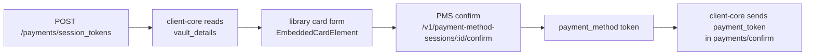
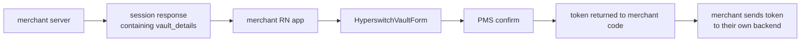
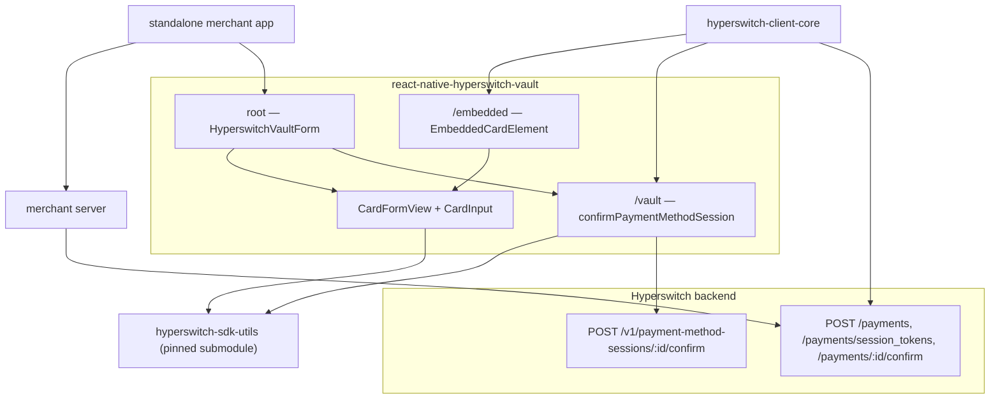

# Card Vault Library: Extraction, Architecture and Integration Journey

> **Status of this document.** Written by inspecting the current source of
> `hyperswitch-client-core`, this library, `hyperswitch-web` (read-only) and the pinned
> `hyperswitch-sdk-utils` submodule — not from earlier phase reports. Where an earlier report
> disagreed with the code, the code won and the difference is called out.
>
> Facts are labelled: **[code]** proven by current source or generated output, **[run]** produced by
> a command executed against this tree, **[manual]** confirmed by a human on a device, and
> **[historical]** true earlier but superseded.

---

## 1. Executive summary

The Hyperswitch card form used to exist only inside `hyperswitch-client-core`, as
`src/components/dynamic/CardElement.res`. It was tightly bound to that app: its theme, locale,
loading state, logger, analytics, native modules and API hooks all came from client-core React
contexts. Nothing else could use it.

Two products needed the same card form:

1. **client-core itself** — its payment sheet must keep rendering the card form with **zero**
   behavioural change, inside the React Final Form instance client-core already owns.
2. **A standalone React Native merchant app** — a merchant who wants a "save a card" step inside
   their own checkout, with no Hyperswitch payment sheet at all.

Both collect a **new card** and end up with a **payment-method token**. What differs is where the
configuration comes from and what happens to the token afterwards. The card form itself, the
validation and the vault network call are identical.

That shared part now lives in this repository, `react-native-hyperswitch-vault`, published as
`@juspay-tech/react-native-hyperswitch-vault` with three entry points. **[code]**

Both new-card flows work today. Saved cards are deliberately a separate, future flow — a different
HTTP verb against a different endpoint, not an extension of this one (§19).

### Final status

| Area | Status | Evidence |
|---|---|---|
| Behaviour contract for the original CardElement | complete | `hyperswitch-client-core/docs/card-element-behavior-contract.md`, 19 sections **[code]** |
| Portable card form extracted | complete | 12 `.res` modules in `src/` **[code]** |
| Library packaging (3 entries, ESM+CJS, genType types) | complete | `package.json` exports, `rollup.config.mjs` **[code]** |
| client-core embedded integration | complete | `HyperswitchVault.res` + `CardVaultHook.res`; `re:check` and `build:web` exit 0 **[run]** |
| Standalone merchant API | complete | `HyperswitchVaultForm` is the root export **[code]** |
| Vault transport (`/vault`) | complete | `VaultConfirm.res`, React/RN-free **[code]** |
| Real sandbox tokenization, standalone | working | non-empty token rendered on device **[manual]** |
| `customer_acceptance` for freshly vaulted cards | complete | 72/72 exhaustive proof over compiled output **[run]** |
| Session refresh clears/replaces vault config | complete | every branch in both refresh sites **[code]** |
| Fail-closed malformed `vault_details` | complete | latest correction, §9 **[code]** |
| Saved-card flows | **not started** | intentionally out of scope |
| npm publication / git commits | **not done** | both repos have this work **staged, never committed** **[code]** |

---

## 2. Original problem and product requirements

### 2.1 Embedded flow (client-core)



### 2.2 Standalone flow (merchant app)



**Standalone mode never performs `payments/confirm`.** The library stops at the token. What the
merchant does with it — charge now, charge later, store against a customer — is entirely theirs.
That is the single biggest behavioural difference between the two consumers. **[code]**

---

## 3. Starting architecture

Everything below describes client-core **before** extraction, and is documented exhaustively in
`docs/card-element-behavior-contract.md` (19 sections, ~1,560 lines). Highlights only here.

| Piece | Role |
|---|---|
| `CardElement.res` | the card form: three fields, focus logic, error rendering, co-badge picker, scan trigger |
| `RequiredFields.res` | the **only** `ReactFinalForm.Form` in the repository |
| `TabElement.res` / `DynamicComponent.res` | the two live parents; they differ materially (see below) |
| `CustomInput.res` | the shared text input, with **eight non-card consumers** |
| `shared-code` (sdk-utils) `Validation.res` | Luhn, per-scheme lengths, formatting, expiry and CVC rules |
| client-core contexts | ThemeContext, LocaleStringDataContext, LoadingContext, LoggerContext, NativePropContext, DynamicFieldsContext, ViewportContext |
| `ScanCardModule.res` | native card scanning |
| `PaymentUtils.res` | builds the confirm body |

### 3.1 The four distinct responsibilities

Keeping these apart is what made extraction possible at all:

| Layer | Owns | Does **not** own |
|---|---|---|
| **React Final Form** | form and field state, validation scheduling, touched/dirty | how anything looks |
| **CardInput** | input presentation — border, floating label, focus ring | what a valid card is |
| **sdk-utils `Validation`** | validation algorithms and formatting | any UI |
| **CardFormView** | the reusable stacked card form: which fields, in what order, focus transitions | theme, locale, network |

### 3.2 Two parents, not one

`TabElement` passes `checkEligibility` and gates submit on eligibility plus nickname validity.
`DynamicComponent` passes neither — so the eligibility check and `cardNotEligibleText` **cannot
occur** on that path. Their `processRequest` functions are forked duplicates with divergent
payment-experience and REWARD handling. Any extraction had to keep both working. **[code]**

### 3.3 The payment-methods POC was not used

A pre-existing payment-methods package existed as a proof of concept. It was explicitly **not** used
as the implementation base — the extraction started from the live `CardElement`, because only the
live code carried the behaviour that had to be preserved.

---

## 4. Behaviour-locking phase

Before moving a line of code, the existing behaviour was written down:
`hyperswitch-client-core/docs/card-element-behavior-contract.md`. Every claim is anchored to a
`file.res:symbol` and tagged Observed / Inferred / Unclear.

It covers field names and the config-driven write paths; formatting and per-scheme grouping; Luhn
(one call site only, inside `cardValid`); scheme length tables; expiry and CVC rules; the focus and
backspace graph; error-visibility predicates; the fused-layout error priority chain; test IDs;
analytics events; loading behaviour; scan-card; outer-form ownership; and the exact submitted body.

### 4.1 Suspected defects — recorded, not fixed

§17.2 of that document lists **15 suspected defects (D1–D15)** as *load-bearing observed behaviour*,
so that extraction would not silently "correct" them. Examples: AmEx grouped 4-4-4-7 because
`cardType` never matches `"AMERICANEXPRESS"` (D1); an effectively unreachable brand-change reset that
lets a stale 4-digit CVC survive a switch to a 3-digit brand (D3); `isCardNumberEqualsMax` hardcoding
`|| length == 16` (D5); eligibility failing open and not being request-sequenced (D7); the PAN
submitted space-formatted (D8); and card inputs remaining editable during payment processing (D10).

**All of D1–D15 remain present in the extracted code**, with one deliberate, documented divergence:

> **D10 diverges between the two entries.** `CardFormView` takes `~editable: bool=true`, so the
> **embedded** path keeps the original stays-editable-while-processing behaviour. The **standalone**
> form passes `editable={!isSubmitting && !disabled}`, so its inputs are genuinely non-interactive
> during a confirmation. This was a deliberate decision for the standalone reset semantics (§7, §14)
> and is **not** a fix to client-core's behaviour. **[code]**

---

## 5. Phase-by-phase implementation journey

### Phase 1 — Decouple CardElement from client-core contexts

**Goal.** Make the card form context-free *without moving repositories*, so the change could be
reviewed against the running app.

**Introduced.** `CardFormTypes.res` (the prop contract plus `selectCardFields`), a card-only
`CardInput.res`, `CardScanTrigger.res`, `CardFormView.res`. `CardElement.res` became a **host
adapter** that reads the contexts and passes resolved values down.

**Dependency edges removed from the portable layer.** ThemebasedStyle, GetLocale, LoadingContext,
LoggerHook, AlertHook, NativePropContext, DynamicFieldsContext, ViewportContext, ScanCardModule,
navigation and API hooks. Each became an explicit prop or callback.

**Decision — a card-only `CardInput`, not a shared `CustomInputBase`.**
`CustomInput` has eight non-card consumers whose behaviour is not covered by tests. Refactoring it
into a shared base would have put all eight in the blast radius of a card change.

*Rejected:* extracting/parameterising `CustomInput`. *Consequence:* some duplication between
`CardInput` and `CustomInput`, accepted deliberately. The behaviour contract records exactly which
`CustomInput` features the card fields relied on, including defaults inherited implicitly.

**Preserved.** Field names, validators, formatters, focus transitions, error timing, test IDs and
the masked card event — unchanged.

### Co-badge and Tooltip decision

The co-badged network picker is rendered with a `Tooltip`, which reads `ViewportContext`. Letting
that into the portable layer would have re-imported a client-core context immediately after removing
the others, and the picker is only needed by client-core.

**Solution.** The portable layer exposes an optional `renderSchemeAccessory` render prop carrying
semantic data only — available schemes, selected scheme, detected scheme, whether to show the picker,
and an `onSelectScheme` callback. client-core supplies the Tooltip and icons. **ViewportContext never
enters the portable layer.** **[code]**

Scan-card got the same treatment as an injected `scanCardCapability` (`isAvailable` + `launch`): the
portable layer owns the trigger UI, the host owns the native module, alerts and logs.

### Phase 2 — Portability closure

Four client-core-owned modules still leaked in. They were replaced by local equivalents:
`CardAnimatedValue.res`, `CardPressable.res`, `CardRenderIf.res`, `CardTestIds.res`. **[code]**

**Analytics hardening.** Telemetry now carries a **field identifier**, not a string:

```rescript
type cardFieldId = CardNumberField | ExpiryField | CvcField
type analyticsEvent = FieldFocused(cardFieldId) | FieldBlurred(cardFieldId)
```

It is therefore **structurally impossible** for a PAN, expiry or CVC to travel through the analytics
channel — the type admits nothing else. The host maps the identifier back to the placeholder string
it logs, so the logged value is unchanged from before. **[code]**

### Library foundation

| Choice | Value | Why |
|---|---|---|
| ReScript | 11.1.4 | matches client-core |
| sdk-utils | git submodule pinned to `1669cc2` | single source of truth for validation; **both repos are currently at this commit** **[run]** |
| Package manager | Yarn 3.6.4, `nodeLinker: node-modules` | one manager for the whole pipeline |
| Node floor | `>=18.18.0` | verified on 18.20.8 |
| Output | `dist/esm/*.js` + `dist/cjs/*.js` | see the `.mjs` trap in §14 |
| Types | genType-generated, committed `src/*.gen.tsx` | public surface visible in review diffs |
| `sideEffects` | `false` | audited: bundle top level is only imports, functions and literal initialisers |

**Why the whole `shared-code` directory is not shipped.** A file-by-file publish would have to ship
the submodule, and Metro does **not** tree-shake across modules — so a React Native merchant would
pay for the entire sdk-utils closure, most of which is unrelated to cards (postal codes for 244
countries, CPF/CNPJ tax-ID validation, and near-dead duplicate validation modules).

**Reachability strategy.** Rollup bundles at publish time with tree-shaking, so only code reachable
from an entry is emitted. Validation is still *compiled from* the pinned submodule, never copied.
The `files` allowlist additionally carries negative entries `!shared-code` and `!shared-code/**`,
because `yarn pack` force-includes README/LICENSE files at any depth. **[code]**

**Three sizes that must not be confused:**

| Measure | Current value | Meaning |
|---|---|---|
| Source repository | 12 `.res` modules + submodule | what a contributor clones |
| npm tarball | **25 files, 109.1 KiB compressed / 539.1 KiB unpacked** **[run]** | what npm stores; contains *all three* entries |
| Merchant runtime contribution | one entry only — `dist/esm/index.js` is **168,268 bytes** unminified **[run]** | what a merchant's app actually bundles |

A merchant never loads all three entries. Source-map analysis of the example's release bundle showed
exactly **one** library module entering it: `dist/esm/index.js`. **[run]**

**Gates that run as part of `yarn build`:** `check-submodule.mjs` (fails on submodule drift or a
dirty submodule) and `check-generated.mjs` (regenerates genType output and fails if the committed
`.gen.tsx` differs). `tsconfig.consumer.json` then type-checks `type-tests/` against the *published*
declarations. **[code]**

### Moving the card form into the library

The portable modules moved here; client-core kept only `CardElement.res` (host adapter) plus a new
binding `src/utility/libraries/HyperswitchVault.res`, and consumes
`@juspay-tech/react-native-hyperswitch-vault/embedded`. **[code]**

**No nested Form in embedded mode.** `VaultEmbedded.res` wraps `CardFormView` and never creates a
`ReactFinalForm.Form`; it binds into client-core's existing one via `useField`. React Final Form
context is an *intentional* dependency of the embedded component. **[code]**

Verified by `re:check` exit 0 and a web build in which the card form and transport are present in the
bundle. **[run]**

---

## 6. hyperswitch-web vault contract investigation

The vault API had no client-side specification we could rely on, so `hyperswitch-web` was read as the
only existing implementation. Findings are recorded in
`docs/hyperswitch-web-vault-contract.md` (14 sections, pinned to the web commit inspected).

**Confirmed contract** — all **[code]**, read from the web source:

| Item | Value |
|---|---|
| Config location | `session_tokens` → `vault_details.vault_type` + `vault_details.vault_data.sdk_authorization` |
| Authorization form | base64 of a comma-separated `key=value` envelope — **not opaque** |
| Session id | `payment_method_session_id`, encoded **inside** that envelope |
| Header | `Authorization: <RAW authorization>` — the raw string, no `Bearer`, no scheme prefix |
| Endpoint | `POST /v1/payment-method-sessions/{id}/confirm` — a **v1** path |
| Body discriminator | `payment_method_type: "card"` |
| Card object | `payment_method_data.card.{card_number, card_exp_month, card_exp_year, card_cvc}` |
| PAN | spaces removed before sending |
| Expiry year | sent as **YYYY** (4-digit), while the card form stores 2-digit |
| Token path | `associated_payment_methods[0].payment_method_token.data` |
| Masked metadata | `payment_method_data.card.{last4_digits, card_isin, expiry_month, expiry_year}` |

Structural example only — never a real credential:

```
Authorization: <REDACTED_SDK_AUTHORIZATION>

{ "payment_method_type": "card",
  "payment_method_data": { "card": {
      "card_number": "<REDACTED_PAN>", "card_exp_month": "MM",
      "card_exp_year": "YYYY",         "card_cvc": "<REDACTED_CVC>" } } }
```

### 6.1 Behaviour found in web that was deliberately **not** copied

| Web behaviour | Why not copied |
|---|---|
| `savePaymentMethod` resolves `null` on every failure | The failure callback becomes unreachable and the real failure mode is a **silent hang with the loader stuck**. Every path here returns a typed result instead. |
| An `api-key: invalid_key` header sent alongside `Authorization` | An artefact of a shared request helper, not part of the contract. Sending a knowingly-invalid credential is noise at best. This library sends exactly `Content-Type` and `Authorization`. |
| The `vault_card` payments-confirm body | That is the *payment* confirm, owned by the host, and its field names differ from the session confirm (§6.2). Copying it into the library would have blurred the ownership line. |

### 6.2 The field-name trap

The two confirms look similar and are not:

| | payment-method-session confirm | payments confirm |
|---|---|---|
| discriminator | `payment_method_type: "card"` | `payment_method: "card"` + `payment_method_type: "debit"` (hardcoded in web) |
| card object | `payment_method_data.card` | `payment_method_data.vault_card`, or `payment_token` |

The library owns the first. The host owns the second. **[code]**

---

## 7. Vault transport design

`src/VaultConfirm.res`, exported at `<package>/vault`. It has **no React and no React Native
dependency** — verified per entry by `verify-tarball.mjs`, which fails the build if
`dist/*/vault.js`'s chunk graph imports either. **[code]** That is what lets the transport be
exercised in a plain Node process.

**Input** is deliberately narrow — the vault `sdkAuthorization` plus a **trusted environment**. The
full `session_tokens` response is *not* accepted, and the endpoint is never taken from the response:

```rescript
type confirmRequest = {
  sdkAuthorization: string,
  environment: vaultEnvironment,   // #production | #sandbox | #integration
  card: cardDetails,
  timeoutMs?: int,                 // no default — see below
  signal?: abortSignal,
}
```

| Environment | Vault host **[code]** |
|---|---|
| `#production` | `https://checkout.hyperswitch.io/api` |
| `#sandbox` | `https://beta.hyperswitch.io/api` |
| `#integration` | `https://dev.hyperswitch.io/api` |

**Output** is a genuine TypeScript discriminated union, produced by ReScript's `@tag("status")`
variant with inline records, which genType emits as
`{status:"success"; result} | {status:"failure"; error}`. `@unboxed` **cannot** express this (two
record cases are not runtime-distinguishable); `@tag` is the construct that works. **[code]**

**Reuse, not reimplementation.** `validateCard` calls sdk-utils `cardValid`, `checkCardExpiry` and
`checkCardCVC`. No Luhn, no length table, no expiry arithmetic is written here.

**Expiry normalisation** happens in exactly one place, `requestExpiryYear`, deriving the century
prefix through sdk-utils rather than hardcoding `"20"`.

**Authorization handling.** A self-contained base64 decoder (rather than `atob`, which is not
guaranteed on every React Native runtime, or a new dependency for twenty lines of arithmetic) decodes
the envelope; only `payment_method_session_id` is read. The other claims are ignored and never
surfaced. **[code]**

**Sanitised errors.** Only the backend's `error.code` is read and mapped to a fixed public string.
The backend's own message is never echoed — it is an unbounded string that may embed request context.

**No logging at all.** The module contains zero `Console` calls, deliberately: the authorization is a
bearer of client secret / customer id / publishable key / profile id, and the request body carries a
PAN and CVC. **[code]**

**No automatic retry, ever.** `retryableForStatus` is an intentionally empty approved mapping.
Nothing in web or client-core approves retrying a PMS confirm, the endpoint accepts no idempotency
key, and backend idempotency is unconfirmed.

**`unknown_outcome` semantics.** A thrown fetch, a timeout and an abort are indistinguishable from
one another *and* from a request the vault already processed, so all three map to `#unknown_outcome`
with `unknownOutcome: true`. There is deliberately **no `network_error` code**, because that name
would imply "the request never happened, retry freely" — which cannot be guaranteed.

**Caller cancellation.** An optional `signal` is honoured by aborting the module's own internal
controller when it fires, keeping a single abort path.

**No module-global concurrency lock.** A global would be wrong for a library that may back more than
one form instance simultaneously. Preventing overlapping confirmations is the consuming component's
job — `HyperswitchVaultForm` and `CardVaultHook` each hold their own in-flight guard.

**Validation failures issue zero requests.** `validateCard` runs before `resolveSessionId` and before
any `fetch`, so an invalid card never reaches the network.

### 7.1 Error mapping — transport code → public result

`VaultResult.res` holds this mapping and imports neither React nor React Native, so
`scripts/verify-result-mapping.mjs` executes the real compiled table in Node. **[run]**

| Transport `vaultErrorCode` | Public `status` | Public `code` |
|---|---|---|
| `#invalid_card_data` | `validation_error` | `invalid_card_data` |
| `#invalid_authorization` | `error` | `invalid_session` |
| `#missing_session_id` | `error` | `invalid_session` |
| `#unknown_outcome` | `error` | `unknown_outcome` |
| `#http_error` | `error` | `server_error` |
| `#malformed_response` | `error` | `server_error` |
| `#missing_token` | `error` | `server_error` |
| *(session unusable, local)* | `error` | `invalid_session` |
| *(fields not registered, local)* | `not_ready` | `not_ready` |
| *(local validation, local)* | `validation_error` | `invalid_card_data` |

The last two rows are worth noting: a **2xx with an unreadable body or no token** maps to
`server_error`, and the vault very likely *did* save the card. It is never auto-retried either.

### 7.2 AbortSignal typing — **resolved**

Earlier in the project the public `signal` was `@genType.opaque`, which emitted
`export abstract class abortSignal` — a type no real value can satisfy, forcing every TypeScript
caller to write `controller.signal as unknown as abortSignal`.

**Current source:** `src/VaultConfirm.res` uses
`@genType.import(("./dom-types", "AbortSignalType"))`, and `dist/types/VaultConfirm.gen.d.ts` now
reads `import type { AbortSignalType as $$abortSignal } from './dom-types'`. **[code]**

The non-obvious part: React Native declares `class AbortSignal` **itself** in
`react-native/src/types/globals.d.ts`, and the stock `@react-native/typescript-config` has **no
`"dom"` lib**. So `tsconfig.build.json` sets `types: ["react-native"]`, and `tsconfig.consumer.json`
*extends the real React Native tsconfig* so `type-tests/vault-consumer.ts` proves a genuine
`new AbortController().signal` is accepted **with no cast**, under a merchant's exact compiler
settings. **This item is closed.** **[run]**

---

## 8. Client-core vault integration

| Module | Role |
|---|---|
| `SessionsType.res` | `getVaultDetails` decodes top-level `vault_details`; `decodeSessionsResponse` returns one `sessionsSnapshot` = `{tokens, vaultDetails}` |
| `VaultContext.res` | carries `option<vaultDetails>` |
| `VaultConfiguration.res` | turns those details into a decision (§9) |
| `CardVaultHook.res` | the **single** submit path used by both call sites |
| `HyperswitchVault.res` | `@module` bindings to `/embedded` and `/vault` |
| `PaymentMethod.res`, `DynamicComponent.res` | the two call sites |

**Why a dedicated `VaultContext` rather than widening `AllApiDataContextNew`.** That context is
destructured as a **3-tuple in roughly twenty places**; adding a fourth member would touch all of
them. More importantly `vault_details` is *response-level*, not a session token — it cannot ride on
the `session_token` array, which is empty for card-only merchants. **[code]**

**Shared in-flight and abort handling.** `useCardVaultSubmit` holds an `inFlight` ref and an
`AbortController` ref, aborting on unmount. A second press while a confirmation runs returns
`AlreadyInFlight`, which compiles to a bare `return ;` at the call sites — deliberately *not* an
error, because a double-press is not a failure. **[code]**

**How a token changes the confirm body.** Compiled proof from `PaymentMethod.bs.js`:

```js
payment_method_data: paymentToken !== undefined ? undefined : mergedPaymentData["payment_method_data"]
```

Token present ⇒ `payment_method_data` omitted entirely and `payment_token` sent. Token absent ⇒ the
body is byte-identical to the pre-vault behaviour. **[code]**

### 8.1 The three payment cases

| Case | `payment_token` | `isFreshVaultToken` | Customer acceptance |
|---|---|---|---|
| Raw new card | absent | `false` | existing new-card conditions |
| Freshly vaulted new card | present | `true` | **same as raw new card** |
| Existing saved card | present | `false` (default) | existing saved-card behaviour |

The gate in `PaymentUtils.generateCardConfirmBody`:

```rescript
(payment_token->Option.isNone || isFreshVaultToken) && <unchanged conditions> && !isGuestCustomer
```

`PaymentMethod.res` and `DynamicComponent.res` pass
`~isFreshVaultToken=paymentToken->Option.isSome` — sound because in those components a token can only
come from the `VaultSucceeded` branch. `SavedPaymentSheet.res` never passes it, so saved cards keep
the default. **[code]**

Verified by lifting the **actual compiled condition** out of `PaymentUtils.bs.js` and evaluating it
across all 72 input combinations: freshly-vaulted ≡ raw-new-card in 72/72, saved-card suppressed in
72/72, and raw new card sends acceptance in 32 of them so the equality is not vacuous. **[run]**

### 8.2 Session refresh

Three modules call `payments/session_tokens`. **[code]**

| Caller | Vault handling |
|---|---|
| `NavigationRouter.res` | effect keyed on `[nativeProp]`, so it re-runs. **All three branches** — error, success, null — either set from the fresh snapshot or clear to `None`. |
| `UpdateIntentHook.res` | success sets from the snapshot; every other outcome clears. This path carries a **new** `sdkAuthorization` and payment id, so a retained config would belong to a superseded intent. |
| `HeadlessUtils.res` | contains **zero** vault references and never writes `setVaultDetails` — the wallet path, not applicable. |

Both live sites parse once via `decodeSessionsResponse`, so tokens and vault config always come from
the same response. The two setters run synchronously inside one `.then`, so React 19 batches them
into a single commit: a consumer can never observe tokens from response *N* alongside vault details
from *N−1*. **An old `sdk_authorization` is never retained on any path.** **[code]**

Session tokens are deliberately **not** cleared on a failed refresh — a stale wallet session token is
inert (the wallet flow revalidates server-side at confirm), and dropping them would change Apple Pay
/ Google Pay behaviour, which is outside this work.

---

## 9. Vault configuration and fail-closed policy

`VaultConfiguration.resolve` is the single place that turns `vault_details` into a decision. These
are the **current** rules, after the latest correction. **[code]**

| `vault_details` | Result | Effect |
|---|---|---|
| **absent** | `NoVault` | normal raw-card flow allowed |
| present but empty `{}` | `InvalidVaultConfiguration` | **stop** — no PMS confirm, no raw-card fallback |
| `vault_type` blank or missing | `InvalidVaultConfiguration` | **stop** |
| `hyperswitch` + blank/missing authorization | `InvalidVaultConfiguration` | **stop** |
| unsupported provider | `UnsupportedVault(provider)` | **stop** |
| valid `hyperswitch` configuration | `HyperswitchVault` | vault flow |

### 9.1 The invariant

> **Only an absent `vault_details` field means "vaulting is not configured."**
> A present-but-malformed object must never silently reopen the raw-card fallback.

The compiled output makes this checkable at a glance — `"NoVault"` is returned on exactly one path:

```js
function resolve(vaultDetails, environment) {
  if (vaultDetails === undefined) { return "NoVault"; }
  switch (vaultDetails.vaultType.trim().toLowerCase()) {
    case "" : return "InvalidVaultConfiguration";
    case "hyperswitch" : return auth.trim().length > 0 ? {TAG:"HyperswitchVault", …}
                                                       : "InvalidVaultConfiguration";
    default: return {TAG:"UnsupportedVault", _0: provider};
  }
}
```

### 9.2 Why this matters

`CardVaultHook` maps `InvalidVaultConfiguration` and `UnsupportedVault` to `VaultFailed`, and the two
call sites reach `continueWithConfirm` from **only** `NoVault` and `VaultSucceeded`. So a malformed
configuration stops the payment rather than sending raw card details for a merchant who asked for a
vaulted card. **[code]**

`SessionsType.getVaultDetails` deliberately still returns `Some({vaultType: "", sdkAuthorization: ""})`
for a present-but-empty object — **presence is preserved**. Collapsing it to `None` there would have
turned fail-closed into fail-open.

### 9.3 Compatibility consequence — behaviour change

> A merchant previously sending `vault_details: {}` to mean "vaulting disabled" **will now receive a
> safe failure** rather than falling through to the raw-card flow. The supported representation for
> disabled vaulting is to **omit `vault_details` entirely**.

This is a real, intentional behaviour change and should be communicated before release.

---

## 10. Standalone merchant API

### 10.1 Generated public types

All generated from ReScript by genType. **[code]**

```ts
type Props = {
  readonly session: MerchantSession;                       // required
  readonly environment: vaultEnvironment;                  // required
  readonly appearance?: appearance;
  readonly disabled?: boolean;
  readonly splitCardFields?: boolean;
  readonly onStateChange?: (_1: cardFormState) => void;
};

type vaultFormHandle = {
  readonly submit: () => Promise<vaultSubmitResult>;
  readonly reset: () => void;
  readonly focus: (_1: "cvc" | "cardNumber" | "expiry") => void;
};

type vaultSubmitResult =
  | { status: "success";          readonly token: string; readonly card: vaultCardMetadata }
  | { status: "validation_error"; readonly error: safeVaultError }
  | { status: "not_ready";        readonly error: safeVaultError }
  | { status: "error";            readonly error: safeVaultError };

type cardFormState =
  { complete, cardNumberValid, expiryValid, cvcValid, brand };   // no card data at all
```

Two genType limitations required composition in `src/public.ts`, never duplication:

1. a `forwardRef` component is typed `React.ComponentType<Props>` with the **ref dropped**, so the
   handle is re-attached as `ForwardRefExoticComponent<Props & RefAttributes<vaultFormHandle>>`
   built from the *generated* `Props` and `vaultFormHandle`;
2. a `JSON.t` prop emitted an import of a non-existent `./JSON.gen`, so `session` is mapped via
   `@genType.import` to a documented `MerchantSession`.

That small facade is checked rather than trusted: `type-tests/consumer.tsx` compiles against
`dist/types` with `@ts-expect-error` negative controls for a wrong `environment`, a wrong `focus()`
field, reading `token` off a non-success and reading `error` off a success. A control that stops
failing is itself a build error. **[run]**

### 10.2 The whole integration

```tsx
// 1. one package installation
//    yarn add @juspay-tech/react-native-hyperswitch-vault

// 2. one merchant-server fetch
const session = await fetch('https://your-backend.example/vault-session').then(r => r.json());

// 3. one component
const formRef = useRef<HyperswitchVaultFormHandle>(null);
<HyperswitchVaultForm ref={formRef} session={session} environment="sandbox" />;

// 4. one submit() call
const result = await formRef.current?.submit();
if (result?.status === 'success') await sendTokenToYourBackend(result.token);
else if (result) showMessage(result.error.message);
```

Merchants never interact with `CardFormView`, React Final Form, sdk-utils, card values,
authorization decoding, or PMS request construction. None of those are reachable from the root entry
surface. **[code]**

**Extra session fields are tolerated.** `MerchantSession` carries an index signature, and the
component reads only `vault_details.vault_type` and `vault_details.vault_data.sdk_authorization`. A
backend that adds fields cannot break the build or the form. **[code]**

### 10.3 Lifecycle contract

Asserted by `example/__tests__/vaultFormLifecycle.test.tsx`, which renders the **published package**
under the real React Native jest preset. **[run]**

| Situation | Behaviour |
|---|---|
| `submit()` twice during one request | the **same promise instance** is returned; exactly one network request |
| `reset()` | clears values, the visible `MM / YY` text, validation state and displayed errors |
| `reset()` **during** an in-flight confirmation | **no-op**, and the request is *not* cancelled |
| `session`/`environment` replaced | a confirmation in flight **under the superseded session** is aborted and detached → `unknown_outcome`; one issued under the new session is untouched |
| Unmount | in-flight confirmation aborted |
| `focus()` before registration or after unmount | safe no-op |

The reset rule deserves its reasoning: cancelling would turn a knowable outcome into an unknown one;
clearing without cancelling would leave emptied fields while a promise that resolves for the *old*
card is outstanding. Refusing until it settles is the only option with no misreadable state, and the
inputs are non-interactive for exactly that window.

---

## 11. React Final Form module-identity problem and solution

### 11.1 The problem

React Final Form connects `<Form>` to `useField` through a React context that lives in the **module
instance**. Two installed copies means two contexts, and the failure is not subtle: react-final-form's
own `useForm()` guard throws `useField must be used inside of a <Form> component`.

client-core owns the `<Form>`; the library calls `useField`. They must resolve to the same instance.
Dependency deduplication alone was not treated as a sufficient guarantee — it depends on the
consumer's tree, their package manager and their version ranges.

### 11.2 The three-entry solution

| Entry | Consumer | react-final-form handling |
|---|---|---|
| root (`.`) | standalone merchant | **bundled in** |
| `./embedded` | client-core | **external** — resolves the host instance |
| `./vault` | transport | **absent** — no React, no RFF, no React Native |

`rollup.config.mjs` exports **two configurations**, because Rollup applies `external` per
configuration, not per entry: one builds `embedded` + `vault` with RFF external, the other builds
`index` with RFF bundled. **[code]**

The package declares **no runtime `dependencies` at all** — `react-final-form` and `final-form` are
**optional peers**. That is the structural half of the fix: npm and yarn have nothing to nest, so the
standalone merchant installs one package and the embedded host's copy is the only one present.
**[code]**

### 11.3 Consumer fixtures

`scripts/verify-consumers.mjs` builds three fixtures from the **packed tarball** and runs 22 checks.
**[run]**

| Fixture | What it proves |
|---|---|
| **A** — standalone, no RFF installed | resolution of `react-final-form` *fails* in the fixture, and the root entry still `require`s cleanly with only react + react-native, exporting a real `forwardRef` |
| **B** — embedded, one host copy | `/embedded` resolves the **host path**, `require()` returns the **same module object** (`===`), and a field created through the package's resolution renders inside the host's `<Form>` (react-dom/server) and registers |
| **C** — nested copy planted deliberately | resolution flips to the nested one, instances differ, and rendering throws RFF's own guard — proving the failure is **loud**, not silent; the root entry is unaffected because it never asks for RFF |

### 11.4 Cost and benefit

| | Value |
|---|---|
| Merchant runtime bundle | **smaller** — Metro cannot tree-shake RFF, Rollup can. The example's release bundle went 1,950,950 → **1,946,115 bytes** (−4,835) **[run]** |
| npm tarball | **larger** — `index` and `embedded` can no longer share chunks, since `CardFormView` must resolve RFF differently in each. Current total **109.1 KiB compressed** **[run]** |
| License obligation | bundling MIT code into a published artifact requires shipping notices — `THIRD-PARTY-NOTICES.md` covers react-final-form, final-form and `@babel/runtime`, and `verify-tarball.mjs` **fails the build** if it does not **[code]** |

---

## 12. Card-only validation and bundle-size control

### 12.1 The problem

`Validation.createFieldValidator` routes through `validateField`, a single switch over roughly two
dozen rules. Referencing it drags in the postal-code table (244 countries), CPF and CNPJ tax-ID
validation and unrelated country data — roughly 55 KiB a card-only merchant never executes.

This was not hypothetical: the first build of the standalone form used `createFieldValidator`, and
`verify:tarball` failed on `defaultPostalCode` / `isValidCPF` / `isValidCNPJ` appearing in the
artifact.

### 12.2 The temporary solution

`HyperswitchVaultForm.res` defines three card-only validators that call sdk-utils
`cardValid`, `checkCardExpiry` and `checkCardCVC` **directly**, with the same messages from
`LocaleDataType.defaultLocale`. **[code]**

**No validation logic is copied.** Luhn, the per-scheme length sets, the expiry window and the CVC
rules all still live in sdk-utils and are *called*. Only the message mapping is local — and that
duplication is the actual debt: a wording change in sdk-utils does not reach this library.

The **embedded** path is unaffected; client-core still passes validators built with
`createFieldValidator`, exactly as before extraction.

### 12.3 Long-term follow-up

`docs/followup-sdk-utils-card-validation.md` proposes a card-only entry point inside sdk-utils
(`createCardFieldValidator`) that must not reference `validateField`, with `createFieldValidator`'s
card branches delegating to it so there is one implementation and one message mapping.

### 12.4 Current proof it stays out

`verify-tarball.mjs` greps every shipped `.js` for `defaultPostalCode`, `isValidCPF`, `isValidCNPJ`
**and** the string literals `Afghanistan` / `Postal code lookup`. The literals matter: identifier
names disappear under a minifier, so an identifier-only check would be worthless against a minified
merchant bundle. Both checks currently pass, and the same literals are absent from the example's
release bundle. **[run]**

---

## 13. Example application and merchant-server setup

Two directories, deliberately separate so "secrets are server-side" is physically true. **[code]**

| | |
|---|---|
| `example/` | bare React Native TypeScript app, a yarn workspace of the library |
| `example-server/` | dependency-free stand-in merchant backend; holds the secret key |

**Consumption.** The library is the repository **root**, and yarn cannot self-link a root workspace,
so `example/scripts/link-library.mjs` creates the `node_modules` symlink a published install would
produce — the example therefore resolves the package **by name, through its `exports` map**, exactly
as a merchant's app does. **[code]**

**Screens.** `src/MerchantCheckout.tsx` is a stand-in storefront whose **Checkout** button calls the
merchant server *first* and only presents the card sheet once a session returns — the ordering a real
integration is forced into, since the form cannot render without one. `src/DeveloperPanel.tsx` is the
bare form plus the controls `docs/manual-device-checklist.md` drives. `App.tsx` switches between them.

**Networking.** Android emulator `http://10.0.2.2:3001`, iOS simulator `http://localhost:3001`, plus a
documented `LAN_OVERRIDE` for a physical device. Cleartext HTTP is enabled in
`android/app/src/debug/AndroidManifest.xml` **only** — the main/release manifest does not allow it.
**[code]**

**Server configuration.** `example-server/.env` (gitignored) and `.env.example` (committed,
placeholders only). Loading uses a hand-written parser because `--env-file` and
`process.loadEnvFile` are Node 20+ and this example supports Node 18. Live mode fails fast listing
**only the missing variable names**; no value is ever printed. The session endpoint sends
`Cache-Control: no-store` — the only directive that forbids *storing* a response carrying a live
credential. **[code]**

**How the server mints a session.** Discovered by reading client-core's own `mockServer.js`:
`POST /payments` with the secret key, then `POST /payments/session_tokens` authenticated with **that
intent's own `sdk_authorization`** rather than the secret key. The intent uses `confirm: false` and
is never confirmed, so no money moves. `POST /v2/payment-method-sessions` — which reads like the more
natural API — is a different API with a different auth model that this account does not serve. **[run]**

**The gitlink problem.** `example/` had been staged as a **gitlink** (mode 160000), so none of its
files were actually tracked. Corrected with `git rm --cached -f example && git add example`;
**60 example files are now tracked**, with `Pods/` and `node_modules/` excluded. **[run]**

### 13.1 What was verified, and how

| Verification | Kind | Evidence |
|---|---|---|
| Android `assembleDebug` | **[run]** | exit 0; APK at `example/android/app/build/outputs/apk/debug/app-debug.apk` |
| Android install + launch + reaches merchant server | **[run]** | `installDebug` exit 0; server logged a served session |
| iOS `pod install` + `xcodebuild` | **[run]** | `** BUILD SUCCEEDED **` on iPhone 17 Pro simulator |
| iOS install + launch | **[run]** | `simctl install` + `launch` succeeded |
| Real standalone sandbox PMS confirm, non-empty token | **[manual]** | success state rendered on device; token value **not reproduced here** |
| client-core embedded card form renders | **[run]** | `build:web` exit 0 with `__card_cvc_unbound`, `CardNumberInputTestId`, `payment-method-sessions` present in the bundle |
| client-core embedded payment end-to-end | **not independently recorded** | — |

No token, authorization, PAN, expiry or CVC appears in this document or in any committed file.

---

## 14. Problems discovered and how they were resolved

| # | Problem | Why it happened | Risk | Chosen solution | Rejected |
|---|---|---|---|---|---|
| 1 | Card form coupled to 7 client-core contexts | it was never meant to be reused | extraction impossible | resolved values passed as explicit props/callbacks | passing the contexts through |
| 2 | `CustomInput` shared by 8 non-card consumers | one input for the whole SDK | a card change breaks unrelated screens | new card-only `CardInput`; `CustomInput` untouched | refactor into a shared base |
| 3 | Co-badge `Tooltip` needs `ViewportContext` | popover positioning | re-imports a host context | `renderSchemeAccessory` render prop; host draws the chrome | extracting Tooltip too |
| 4 | sdk-utils closure balloons the bundle | Metro does not tree-shake across modules | merchants pay for 244 country postal codes | Rollup bundling with tree-shaking at publish time | shipping `shared-code/` per-module |
| 5 | `createFieldValidator` re-drags PostalCodes/CPF/CNPJ | one switch over all rules | ~55 KiB of dead weight | card-only validators calling sdk-utils directly | copying validation logic |
| 6 | genType drops the ref on `forwardRef` | genType limitation | merchants cannot type the ref | compose `ForwardRefExoticComponent` from *generated* types in `public.ts` | hand-writing the prop types |
| 7 | `JSON.t` prop emits `./JSON.gen` import | genType limitation | declarations do not compile | `@genType.import` → documented `MerchantSession` | leaving it `any` |
| 8 | Two react-final-form instances ⇒ two contexts | monorepo/consumer hoisting | embedded card form cannot register | 3 entries; RFF bundled in root, external in `/embedded`; no runtime deps | trusting deduplication |
| 9 | Yarn caches `file:` tarballs by path | package-manager behaviour | testing a stale artifact | unique temp path per pack (`pack-fixture.mjs`) | **bumping the version** — [historical] this *was* done once and has since been reverted |
| 10 | Two configs duplicate chunks, tarball grows | `CardFormView` must resolve RFF two ways | larger npm artifact | accepted; per-consumer bundle is what matters | one config (cannot express per-entry externals) |
| 11 | `reset()` left the visible `MM / YY` on screen | expiry lives in React state, not RFF | stale card data visible after reset | `registerControls` (`Some` on mount / `None` on unmount) also clears local state | deriving expiry from RFF (would change embedded behaviour) |
| 12 | A superseded request cleared the live request's abort handle | one shared slot | a request carrying PAN+CVC outlives its form | tag the handle with `(sessionKey\|environment, controller)`; clear only on match | none — straight bug |
| 13 | Stale `sdk_authorization` across refreshes | only the success branch wrote the context | confirming into a superseded session | every branch in both refresh sites sets **or clears** | clearing session tokens too |
| 14 | `customer_acceptance` inferred "saved card" from token presence | vaulting made tokens ambiguous | mandates silently dropped for vaulted cards | `~isFreshVaultToken` flag; logic stays centralised in `PaymentUtils` | branching at call sites |
| 15 | Malformed `vault_details` fell back to raw card | blank `vault_type` mapped to `NoVault` | **raw PAN sent for a merchant who configured vaulting** | only `None` ⇒ `NoVault`; everything else fails closed | collapsing invalid to `None` in `getVaultDetails` (fail-open) |
| 16 | `example/` staged as a gitlink | added while it still had `.git` | 60 files silently untracked | `git rm --cached -f example && git add example` | leaving it |
| 17 | Bundled MIT code shipped without notices | RFF now inlined in the root entry | license non-compliance | `THIRD-PARTY-NOTICES.md`, enforced by `verify-tarball.mjs` | omitting it |
| 18 | `.mjs`/`.cjs` entries silently dropped by webpack | client-core's `excludeConfiguration` allowlist turns unknown extensions into 42-byte `asset/resource` stubs — **the build SUCCEEDS and the card form is simply missing** | invisible production breakage | dual `dist/esm/*.js` + `dist/cjs/*.js` with per-directory `package.json` type markers | shipping `.mjs`/`.cjs` |
| 19 | Two `react-native` copies in the example | workspace hoisting + symlinked library | `View config getter callback for AndroidTextInput must be a function` at first render | pin resolution in `metro.config.js` (and `moduleNameMapper` for jest) | `extraNodeModules` (only consulted when resolution *fails*) |
| 20 | iOS build failed on `fmt` 11.0.2 | RN 0.79 pins a fmt whose consteval path Xcode 26 Clang rejects | iOS unbuildable | build **only** the `fmt` pod as C++17 via `post_install` | upgrading fmt or React Native |

Items 18–20 are environment/integration traps rather than design errors, and are the ones most
likely to bite a new engineer first.

---

## 15. Security decisions

| Decision | Detail |
|---|---|
| Secret API keys stay server-side | only `example-server/` holds one; the app has no `.env` by design **[code]** |
| `sdk_authorization` is short-lived client configuration | a bearer of client secret / customer id / publishable key / profile id — treated like a bearer token, never persisted |
| No credentials in source, fixtures or logs | every fixture is base64 of an obviously fake envelope; `gitleaks` clean **[run]** |
| No card or token persistence | session lives in component state; nothing written to AsyncStorage or a persisted store |
| No raw backend messages | only `error.code` is read and mapped to fixed strings |
| No automatic retry on unknown outcome | no idempotency key exists; a retry can vault twice |
| Trusted environment, not an arbitrary URL | the vault host is selected from `#production`/`#sandbox`/`#integration`, never taken from the response **[code]** |
| Fail-closed for configured-but-invalid vaulting | §9 |
| Zero logging in the library | no `Console` call anywhere in `VaultConfirm.res` **[code]** |
| No PCI claim | the design keeps card values out of merchant code — a statement about data flow, **not** a claim of PCI DSS compliance or scope reduction |

One deliberate exception, documented in place: `example/App.tsx` and `MerchantCheckout.tsx` **render
the returned token on screen** so a developer can check it against their dashboard. It is an example
affordance, explicitly marked as not a pattern to copy, and it is *displayed* rather than *logged* —
logs persist in Metro, logcat and Console.app; a rendered string does not.

---

## 16. Verification history and current evidence

| Check | Command / file | Current result |
|---|---|---|
| Library ReScript build | `yarn re:build` | exit 0 **[run]** |
| Generated declaration drift | `scripts/check-generated.mjs` | 5 generated files in sync, 5 tracked **[run]** |
| Submodule pin | `scripts/check-submodule.mjs` | pinned `1669cc2`; both repos at that commit **[run]** |
| Published declarations compile | `tsc -p tsconfig.build.json` | exit 0 **[run]** |
| TypeScript consumer checks | `tsc -p tsconfig.consumer.json` (extends the real RN tsconfig) | exit 0, all `@ts-expect-error` controls firing **[run]** |
| Tarball contents | `yarn verify:tarball` | OK — **25 files, 109.1 KiB compressed / 539.1 KiB unpacked** **[run]** |
| Result-mapping table | `yarn verify:mapping` | 7 transport codes + 3 local outcomes **[run]** |
| Consumer module identity | `yarn verify:consumers` | **22 checks across 3 fixtures** **[run]** |
| Example type-check | `tsc --noEmit` in `example/` | exit 0 **[run]** |
| Example test suite | `yarn jest` in `example/` | **12 tests, 2 suites, all passing** **[run]** |
| Metro release bundle | `react-native bundle` | succeeds; **1,946,115 bytes**, one library module, zero RFF module paths **[run]** |
| Android build | `./gradlew app:assembleDebug` | `BUILD SUCCESSFUL` **[run]** |
| Android install/launch/reach server | `installDebug` + `am start` | app fetched a session **[run]** |
| iOS build | `xcodebuild … -sdk iphonesimulator` | `** BUILD SUCCEEDED **` **[run]** |
| iOS install/launch | `simctl install` + `launch` | launched **[run]** |
| client-core ReScript | `yarn re:check` | exit 0 **[run]** |
| client-core web | `yarn build:web` | exit 0, 0 errors, 2 pre-existing asset-size warnings **[run]** |
| client-core embedded form in bundle | grep of `reactNativeWeb/dist` | `__card_cvc_unbound`, `CardNumberInputTestId`, `payment-method-sessions` present **[run]** |
| `customer_acceptance` semantics | compiled-condition evaluation, 72 combinations | 72/72 both ways **[run]** |
| Vault classification | compiled `resolve` over 10 shapes | only absent ⇒ raw-card flow **[run]** |
| Real standalone sandbox tokenization | on-device | non-empty token returned **[manual]** |
| client-core embedded payment end-to-end | — | **not independently recorded** |
| Full manual device matrix | `docs/manual-device-checklist.md` | **not completed** |

### 16.1 Size evolution — [historical], not current

| Point in time | Tarball compressed | Note |
|---|---|---|
| First packaging experiment | 9.1 KiB | before the card form moved in |
| After the standalone API | 44.8 KiB | single Rollup config, RFF external |
| **Current** | **109.1 KiB** | two configs; RFF bundled into the root entry |

Do not quote the first two as current. The growth is the deliberate trade in §11.4.

---

## 17. Current architecture and ownership boundaries



| Component | Owns | Must **never** own |
|---|---|---|
| **Merchant server** | secret API key, session creation, storing the token | card values; being callable for an arbitrary customer |
| **Standalone merchant app** | all chrome, when to submit, result copy and placement, token hand-off | secret keys; card values; authorization decoding |
| **client-core** | the `<Form>`, theme, locale, scan-card, co-badge chrome, `payments/confirm` | the PMS confirm request; card formatting/validation rules |
| **Library root entry** | the standalone form, its single `<Form>`, the submit lifecycle | any host context; `payments/confirm`; logging |
| **Library `/embedded`** | binding into the host's form via `useField` | creating a `Form`; any network call |
| **Library `/vault`** | the PMS confirm request/response and result mapping | React, React Native, UI, retries, logging |
| **sdk-utils** | Luhn, scheme tables, formatting, expiry/CVC rules, masked event payload | UI; networking |
| **Hyperswitch backend** | vault storage, tokens, mandates | — |

---

## 18. Current completion status

**Completed** — each backed by evidence in §16:

- behaviour extraction and the 19-section behaviour contract;
- portable card form (12 `.res` modules) with no host imports;
- library packaging: 3 entries, ESM+CJS, genType declarations, drift and submodule gates;
- embedded client-core integration, compiling and present in the web bundle;
- standalone merchant API with generated types and a checked ref facade;
- Android and iOS example builds, install and launch;
- real standalone sandbox token return **[manual]**;
- `customer_acceptance` preservation across all 72 combinations;
- session-refresh replace-or-clear on every branch;
- fail-closed handling of malformed `vault_details`;
- **reset-during-submit** — verified in current source: `reset()` is a no-op while `inFlightRef` is
  set **[code]**;
- **AbortSignal typing** — verified resolved in current source and in `dist/types` (§7.2) **[code]**;
- **release-version cleanup** — version is back to `0.7.0`, **no `.tgz` exists in the repository**,
  and verification packs to a unique temp path **[run]**.

**Not implemented:**

- saved-card listing;
- saved-card CVC update;
- `update-saved-payment-method` transport;
- standalone `payments/confirm`;
- a payment sheet inside the standalone library;
- scan-card in standalone mode;
- the client-core-only co-badge Tooltip in standalone mode;
- **package publication** — the package is not published;
- **git commits** — *both* repositories have this work **staged but never committed**. The library
  repo has **no commits at all** (120 staged files on `master`); client-core's HEAD is `1eea95c`, an
  unrelated upstream commit, with 11 vault-related paths staged. **[run]**

**Open / carried forward:**

- client-core still depends on `file:../react-native-hyperswitch-vault` — a **local path**, which
  must become a published version range before merge **[code]**;
- standalone labels and validation messages are **English only** (no `labels`/`locale` prop), so a
  non-English merchant cannot localise the standalone form; `/embedded` is unaffected;
- the sdk-utils card-only validator entry point (§12.3);
- the full manual device matrix in `docs/manual-device-checklist.md`.

---

## 19. Saved-card direction

Saved cards are **not** an extension of the new-card confirm request. From the web contract
investigation: **[code]**

| Flow | Transport |
|---|---|
| New card | `POST /v1/payment-method-sessions/{id}/confirm` |
| Saved card needing CVC | `PUT /v1/payment-method-sessions/{id}/update-saved-payment-method` |

Different verb, different path, different body, different result shape. They should stay **separate
transport functions and separate public flows** because:

1. folding them into one function would make the request shape depend on a runtime flag, which is
   exactly the ambiguity that caused the `customer_acceptance` bug (§14, item 14);
2. the result types differ — a saved-card update does not mint a new payment-method token in the same
   sense, so a shared union would carry fields that are meaningless in one branch;
3. the public API stays honest: a merchant calling "save this new card" and a merchant calling
   "update the CVC on a stored card" are doing different things and should say so in the type system.

No saved-card support was implemented during this documentation task.

---

## 20. Decision log

| # | Decision | Reason | Alternative rejected | Consequence |
|---|---|---|---|---|
| 1 | Write a behaviour contract before touching code | no tests locked the behaviour | extract first, verify later | 19-section document; suspected defects preserved rather than silently "fixed" |
| 2 | Preserve suspected defects D1–D15 | changing them is a product decision | fix during extraction | extracted code matches original behaviour; D10 diverges for standalone only, documented |
| 3 | Card-only `CardInput`, leave `CustomInput` alone | 8 non-card consumers, no tests | shared base component | some duplication, zero blast radius |
| 4 | Co-badge chrome stays in client-core behind a render prop | Tooltip needs `ViewportContext` | extract Tooltip too | portable layer stays context-free |
| 5 | Bundle with Rollup instead of shipping per-module | Metro does not tree-shake | `react-native-builder-bob` | merchants pay only for reachable code |
| 6 | sdk-utils as a pinned submodule, never copied | one validation source across all SDKs | vendoring validation | submodule drift gate required |
| 7 | genType for declarations, `.gen.tsx` committed | ReScript is the source of truth | hand-written `.d.ts` | drift gate; public surface visible in diffs |
| 8 | `@tag("status")` variants for results | real TS discriminated unions | `@unboxed` (cannot express two record cases) | impossible states unrepresentable |
| 9 | `#unknown_outcome` instead of `network_error` | abort/timeout may have been processed | a "network error" code | no misleading "safe to retry" signal |
| 10 | Empty `retryableForStatus`, no auto-retry | no idempotency key | retrying 5xx | duplicate vaulting impossible from our side |
| 11 | Dual `dist/esm` + `dist/cjs`, both `.js` | client-core's webpack drops unknown extensions **silently** | `.mjs`/`.cjs` entries | independent of any consumer's loader allowlist |
| 12 | Dedicated `VaultContext` | `AllApiDataContextNew` destructured as a 3-tuple in ~20 places | widen that context | small, isolated change |
| 13 | `~isFreshVaultToken` flag in `PaymentUtils` | a token no longer implies "saved card" | branching at each call site | acceptance logic stays centralised |
| 14 | Three entries, RFF bundled only in root, zero runtime deps | two RFF instances break `useField` | trusting deduplication | tarball grows; merchant bundle shrinks |
| 15 | Card-only validators in the standalone form | `createFieldValidator` drags in 55 KiB | copy validation logic | message mapping duplicated; sdk-utils follow-up filed |
| 16 | `reset()` refused while a submit is in flight | cancelling manufactures an unknown outcome; clearing leaves a misreadable pending result | either alternative | inputs non-interactive for exactly that window |
| 17 | Only absent `vault_details` ⇒ `NoVault` | a malformed object must not reopen the raw-card path | collapse invalid to `None` | **behaviour change**: `vault_details: {}` now fails safely |
| 18 | Unique temp path per pack | package managers cache `file:` tarballs by path | bump the version to bust caches | version numbers stay release metadata |
| 19 | Merchant server mints sessions via `/payments` → `/payments/session_tokens` | discovered from client-core's `mockServer.js`; the v2 PMS-create route is a different API this account does not serve | `POST /v2/payment-method-sessions` | example works against a real sandbox |
| 20 | Build only the `fmt` pod as C++17 | RN 0.79 pins fmt 11.0.2, which Xcode 26 Clang rejects | upgrade fmt or React Native | one `post_install` hook, every other target keeps C++20 |

---

*Every size, count and command result in this document was measured against the tree as it exists
now. Re-measure after any dependency or packaging change before quoting these numbers.*
